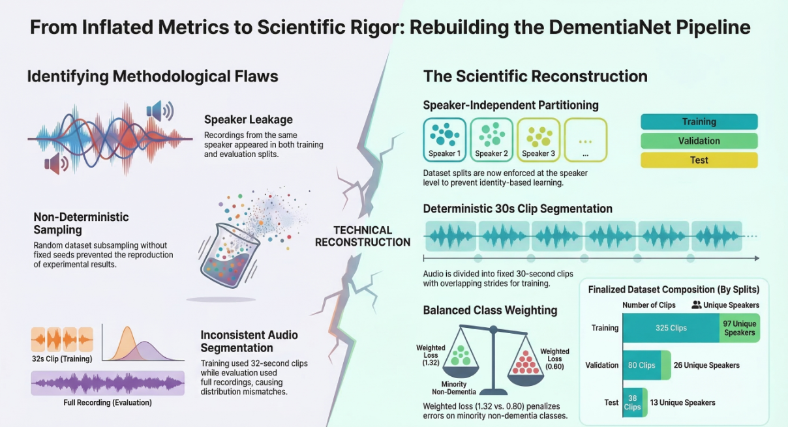
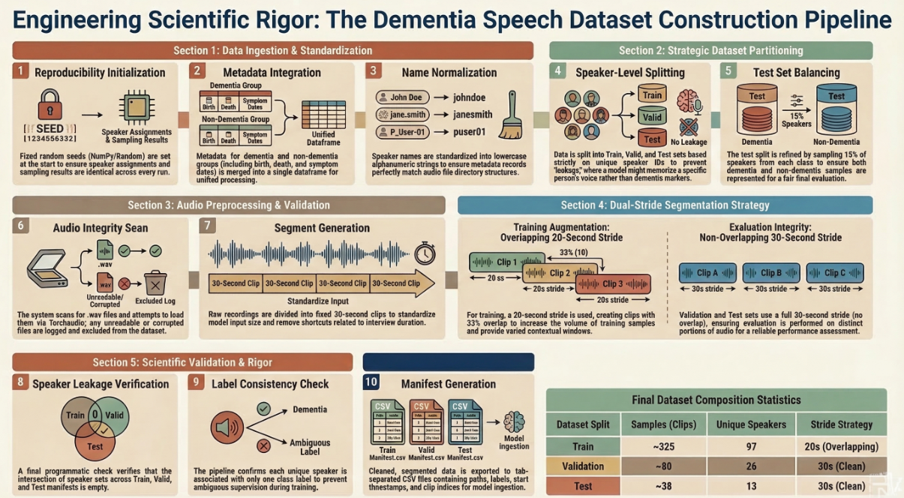
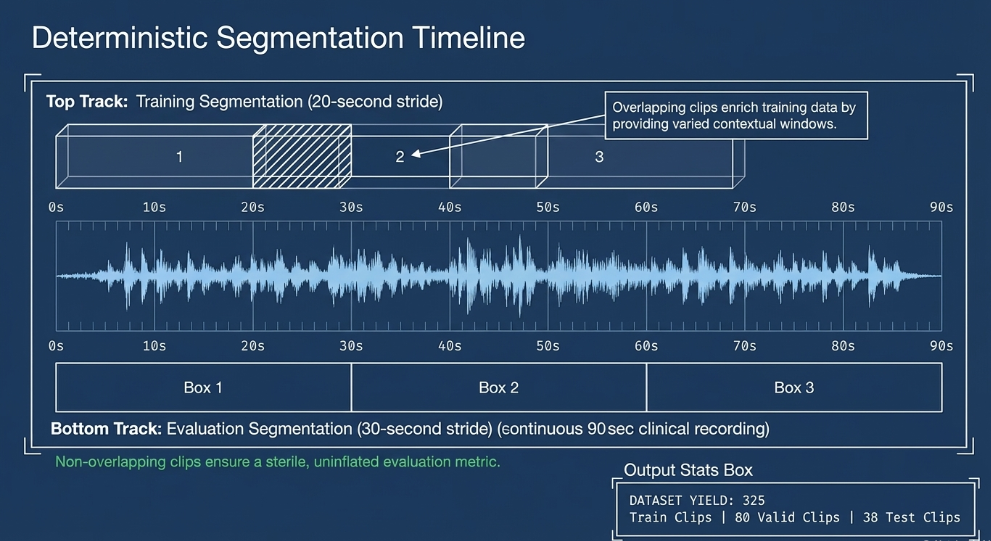
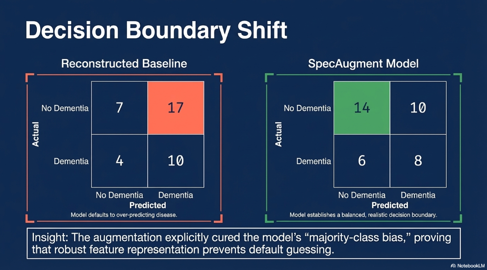

# Speech Based Dementia Detection with Wav2Vec2 and SpecAugment
> Reproducible reconstruction of a dementia speech classification baseline with a controlled SpecAugment experiment.

## Project Overview

This project implements and extends a speech based dementia detection pipeline using a fine tuned Wav2Vec2 model. The objective is to reproduce an existing research baseline and introduce a controlled augmentation experiment to evaluate performance improvements under limited data conditions.

The original framework was provided as part of a structured baseline workflow consisting of:

1. Data preparation  
2. Model fine tuning  
3. Evaluation  

Original repository:  
https://github.com/shreyasgite/dementianet/tree/main?tab=readme-ov-file

This NeuralNets repository reconstructs the original pipeline, introduces a scientifically validated baseline, and documents the updates required to execute the workflow under modern deep learning libraries, along with an experimental extension using SpecAugment.

---

## Installation

Clone the repository:

```bash
git clone https://github.com/Msmetamorphosis/NeuralNets_Project_DementiaNet.git
```

Navigate into the project directory:

```bash
cd NeuralNets_Project_DementiaNet
```

Install dependencies:

```bash
pip install -r requirements.txt
```

---

## Environment

The project was developed using:

- Python 3.10  
- PyTorch >= 2.0  
- Transformers >= 4.36  

All required dependencies are listed in **requirements.txt**.

---

## Research Context

Automatic dementia detection through speech analysis is an active research area within:

- Medical AI  
- Computational linguistics  
- Low resource learning  
- Clinical decision support systems  

Cognitive decline often manifests in speech patterns through:

- Reduced lexical richness  
- Increased pauses  
- Fluency degradation  
- Prosodic changes  

This project approaches the problem as a supervised binary classification task:

**Healthy Control vs Dementia**

A pretrained Wav2Vec2 speech encoder is fine tuned for this downstream classification objective.
---

## Methodology

The experimental pipeline implemented in this repository follows a structured workflow designed to ensure reproducibility and scientific validity.



The system is organized into the following stages.

### 1 Dataset Construction

Raw audio recordings are processed and converted into a structured dataset suitable for model training.

This stage includes:

- audio loading and preprocessing
- segment generation from source recordings
- metadata association
- dataset manifest creation
  


### 2 Validated Dataset Finalization

A validation stage is introduced to ensure that the training dataset meets consistency and quality requirements.

This stage introduces:

- deterministic audio segment construction
- dataset validation checks
- filtering of invalid samples
- standardized dataset formatting for training

   

### 3 Scientific Baseline Training

A pretrained Wav2Vec2 speech encoder is fine tuned for binary dementia classification.

The training pipeline includes:

- audio feature extraction using the Wav2Vec2 processor
- model fine tuning using the HuggingFace Trainer
- class weighted cross entropy loss for imbalance handling
- periodic evaluation during training

This stage establishes the baseline model used for experimental comparison.

### 4 SpecAugment Experimental Extension

After establishing the baseline model, a controlled experimental condition introduces SpecAugment.

SpecAugment performs structured masking along time and frequency dimensions during training. This improves model robustness by encouraging the model to learn more generalized acoustic representations.

Two training conditions are evaluated:

Baseline model without augmentation  
Model trained with SpecAugment enabled

### 5 Evaluation and Comparison

The trained models are evaluated using several performance metrics including:

- accuracy
- precision
- recall
- macro F1 score

Comparative evaluation enables measurement of the impact of augmentation on model performance and generalization.
---

## Baseline Reproduction

The initial goal of this project was to reproduce the DementiaNet baseline pipeline.

The original implementation relied on older versions of the HuggingFace Transformers library. Running the pipeline with modern frameworks required several updates.

Key compatibility fixes included:

- updating the custom Trainer implementation

- refactoring deprecated training calls

- resolving API changes in Transformers

- ensuring compatibility with modern PyTorch versions

These updates allowed the baseline pipeline to execute successfully using current deep learning frameworks.

---

## Model Architecture

The classification model uses the built in HuggingFace implementation:

`Wav2Vec2ForSequenceClassification`

This architecture consists of:

1. Pretrained Wav2Vec2 speech encoder  
2. Internal sequence level pooling of frame representations  
3. Dropout regularization  
4. Linear classification layer  

The encoder extracts contextual speech embeddings from raw waveform input. These embeddings are pooled across time to produce a single utterance level representation which is passed to a linear classifier.

The model predicts two labels:

0 → Healthy Control  
1 → Dementia

---

## Loss Function

Training uses **class weighted cross entropy loss**.

Class weights are applied during training to mitigate class imbalance between dementia and control samples.

This is implemented through a custom Trainer class that overrides the loss computation while still leveraging the HuggingFace Trainer training loop.

---

## Training Configuration

Model training uses the HuggingFace Trainer framework.

Key configuration settings include:

  - pretrained facebook/wav2vec2-base encoder

  - class weighted loss

  - epoch based evaluation

  - checkpoint saving each epoch

The baseline model is trained for 22 epochs, matching the configuration used in the original implementation.

The purpose of this stage is to establish a stable and reproducible baseline before introducing experimental augmentation.

---

## Evaluation



Model evaluation is performed using a held out dataset.

Evaluation metrics include:

- Accuracy  
- Precision  
- Recall  
- Macro F1 score  

Macro F1 is used as the primary evaluation metric because it balances performance across both classes and is robust to class imbalance.

Evaluation also includes confusion matrix analysis to examine prediction behavior across classes.

---

## Running the Pipeline

The scientific pipeline should be executed in the following order.

### 1 Build the validated dataset

```
notebooks/scientific_pipeline/00_build_scientific_dataset.ipynb
```

### 2 Prepare the dataset for training

```
notebooks/scientific_pipeline/01_finalize_validated_dataset.ipynb
```

### 3 Train the Wav2Vec2 classification model

```
notebooks/scientific_pipeline/02_train_scientific_baseline.ipynb
```

### 4 Evaluate the trained model

```
notebooks/scientific_pipeline/03_evaluate_scientific_baseline.ipynb
```

Each notebook should be executed sequentially to reproduce the full training and evaluation workflow.

---

## Repository Structure

```
NeuralNets_Project_DementiaNet
│
├── config.py
├── requirements.txt
├── README.md
│
├── data
│   ├── metadata
│   ├── manifests
│   └── clean_dataset
│   └── audio
│
├── notebooks
│   ├── baseline_original
│   └── scientific_pipeline
│   └── specaugment
│
├── models
│
└── results
```

---

## Key Components

**config.py**

Centralized configuration file used to define dataset paths and experiment settings.

**requirements.txt**

Dependency list required to reproduce the environment used for training and evaluation.

**notebooks/baseline_original**

Contains the reproduction of the originally provided DementiaNet pipeline.

**notebooks/scientific_pipeline**

Contains the validated experimental pipeline used for dataset preparation, training, and evaluation.

---

## Dependencies

Major libraries used in this project include:

- PyTorch  
- HuggingFace Transformers  
- HuggingFace Datasets  
- Scikit Learn  
- Librosa  
- NumPy  
- Pandas  
- Matplotlib  

All dependencies are listed in **requirements.txt**.

---

## Key Contributions of This Implementation

- Reproduction of a speech based dementia detection baseline  
- Modernization of legacy training code for current Transformers infrastructure  
- Integration of SpecAugment as a controlled experimental variable  
- Structured baseline vs augmentation experimental design  
- Reproducible training and evaluation pipeline

---

## Future Extensions

Potential next steps include:

- Early stopping integration  
- Cross validation across folds  
- Additional augmentation strategies  
- Hyperparameter optimization  
- Model scaling experiments

---

## Conclusion

This project establishes a reproducible speech based dementia detection baseline and extends it through structured experimentation with SpecAugment.

The repository provides a complete deep learning workflow including:

- Data preparation  
- Model training  
- Experimental augmentation  
- Performance evaluation  

This framework provides a foundation for further research into speech based cognitive impairment detection.

## Project Contributions

This project was completed as a collaborative research effort involving baseline reproduction, pipeline redesign, experimental validation, and augmentation based experimentation built upon the original DementiaNet implementation.

### Crystal Tubbs

- Led the development of the experimental pipeline and coordination of overall research workflow
- Reproduced and repaired the original DementiaNet baseline implementation to run with current deep learning libraries
- Updated and repaired the original baseline notebooks:
  - `01_prepare_dataset.ipynb`
  - `02_finetune_model.ipynb`
  - `03_evaluate_model.ipynb`

- Extended the dataset pipeline from the initial dataset construction (00 notebook) and implemented a validated, scientifically rigorous dataset processing workflow:
  - `01_finalize_validated_dataset.ipynb`

- Designed and implemented the scientific baseline training and evaluation pipeline:
  - `02_train_scientific_baseline.ipynb`
  - `03_evaluate_scientific_baseline.ipynb`

- Designed and implemented the SpecAugment experimental extension:
  - `02_train_scientific_specaugment.ipynb`
  - `03_evaluate_scientific_specaugment.ipynb`

- Implemented dataset validation checks and deterministic audio segment construction
- Implemented the full Wav2Vec2 training workflow using Hugging Face Trainer
- Implemented the experiment comparison framework for baseline vs SpecAugment evaluation

### Destiny Raburnel

- Implemented the initial dataset construction notebook (`00_build_scientific_dataset.ipynb`) based on the project pipeline design
- Created the centralized configuration file (`config.py`) used to standardize dataset paths and experiment settings
- Assisted with repository organization 
- Re executed the validated training and evaluation pipeline to confirm reproducibility of experimental results
- Expanding the SpecAugment evaluation notebook (`03_evaluate_scientific_specaugment.ipynb`) with:
  - additional visualizations
  - experiment analysis comparisons
  - improved documentation and commentary
- Developing the `04_results_analysis.ipynb` notebook for comparative experiment visualization

### Josh Zuniga

- Explored alternative implementation approaches during early stages of the project to evaluate potential training and preprocessing strategies
- Contributed to experimentation around pipeline configuration 
- Implementing experiment result logging and metric tracking
- Organizing experiment outputs in the `results/` directory
- Assisting with dataset statistics analysis and project documentation

## Reproducibility

Experiments were executed using fixed random seeds to ensure reproducibility of results across runs.

Training, evaluation, and dataset construction steps are fully documented within the provided notebooks and can be reproduced by executing the pipeline in the order described in the "Running the Pipeline" section.

## Experiment Results

| Experiment | Accuracy | Precision | Recall | F1 Score |
|-----------|----------|----------|--------|---------|
| Baseline Wav2Vec2 | TBD | TBD | TBD | TBD |
| Wav2Vec2 + SpecAugment | TBD | TBD | TBD | TBD |
